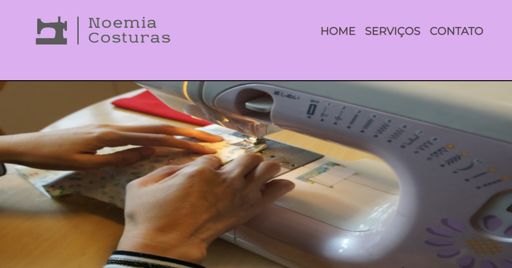

<h1>:link:Noemia Costuras</h1> 

  Este repositório tem como objetivo a divulgação da marca Noemia Costuras, uma micro-empresa sediada em São Paulo.

  O projeto relaciona o empreendedorismo brasileiro com a revolução tecnológica. A empresa em questão é uma das primeiras em seu bairro a ter um website para divulgação de seus produtos.

  

 

<h2>
  :link:
  Layout do projeto
</h2>

 

<h2>:link: Tecnologias utilizadas</h2>

<ul>
 <li>HTML</li>
 <li>CSS</li>
 <li>JavaScript</li>
  <li>EmailJS API</li>
 <li>Sweet Alert Library</li>
</ul>

 

<h2>:link: Autor</h2>

<h4>Rafael Prado de Jesus</h4>

  
  
  
  
  

